# Лабораторная работа №2 Виртуальный сервер

## Студент : Борисенко Дарья
## Группа : IA2403
## Дата выполнения 18.02.2026 

## Описание задачи: 

Целью лабораторной работы является установка  операционной системы Debian в виртуальной машине с использованием  QEMU и настройка веб-серверной среды. Необходимо создать репозиторий проекта, подготовить структуру каталогов. Далее требуется установить Debian без графического интерфейса.

 Также требуется скачать и установить PhpMyAdmin и WordPress, создать базу данных и пользователя для WordPress.  В завершение необходимо проверить работоспособность сервера и доступность сайтов через браузер.

## Итак, начнем же наш отчет о проделанной работе

***Нет повести печальнее на свете, чем повесть о том, как Даша делала 2 лабу...***

## Подготовка

- С сайта [Debian](https://www.debian.org/distrib/) был скачан дистрибутив Debian для серверов архитектуры x64 без графического интерфейса.В качестве системы виртуализации был использован [Qemu](https://www.qemu.org/download/)

## Выполнение поставленной задачи 

Был создан репозиторий containers02 и склонирован на  компьютер.

В папке корневой папке были созданы:
- папка dvd
- файл readme.md
- файл .gitignore

В папку dvd был помещён ISO-образ дистрибутива Debian.

В файл .ditignore были добавлены следующие записи:
- .qcow2
- .iso
- .zip


Далее мы создаем образ диска для виртуальной машины с помощью команды:

`qemu-img create -f qcow2 debian.qcow2 8G`

где : 
- `qemu-img` - утилита qemu для работы с образами дисков
- `create` - соманда для создания диска 
- `-f qcow2` - формат диска. мы используем qcow2, так как он позволяет экономить место, поддерживает сжатие и динамически изменяет размер 
- `debian.qcow2` - имя файла

*Изучаем дополнительные параметры утилиты* : 
Видим что команды выполняют следующие задачи: 
создания виртуальных дисков, изменения их размера,проверки целостности, конвертации форматов, управления снапшотами

Общий вид 

`qemu-img [standard options] COMMAND [--help | command options]`

Устанавливаем Debian на ВМ с помощью команды: 

`qemu-system-x86_64 -hda debian.qcow2 -cdrom dvd/debian.iso -boot d -m 2G
`

где :
- `qemu-system-x86_64` - команда для запускания вм с 64битной архитектурой
- `-hda debian.qcow2` - указываем на какой виртуальный диск устанавливать 
- `-cdrom dvd/debian.iso` - подключаем наш iso образ
- `-boot d` - указываем порядок загрузки, у нас с виртуального диска 
- `-m 2G` - выделяем оперативную память в размере 2гб

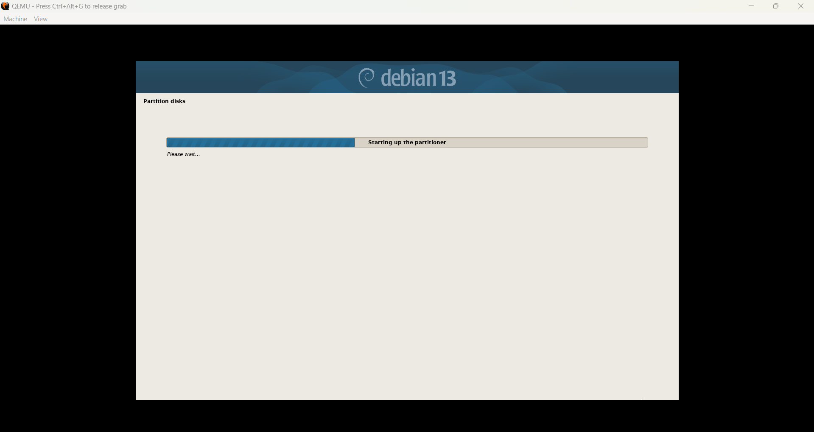

При установке используем слуедующие параметры:
```
Имя компьютера: debian;
Хостовое имя: debian.localhost;
Имя пользователя: user;
Пароль пользователя: password;
```
Далее мы перезагружаем вм.

`D:\programs\qemu\qemu-system-x86_64.exe -hda D:\univer\konteiners\lab02\debian.qcow2 -m 2G -smp 2 -device e1000,netdev=net0 -netdev user,id=net0,hostfwd=tcp::1080-:80,hostfwd=tcp::1022-:22
`

***На этом моменте начинается борьба за выживание*** - так как Даша, умная и добросовестная студентка, названия папок на ее кампудактере, конечно же на русском, так что вм отказывалась запускаться, пока в пути были русские символы, что конечно же она не сразу поняла :) 


где : 

- qemu-system-x86_64.exe - запуск виртуальной машины архитектуры x64

- hda debian.qcow2 - подключение виртуального диска

- m 2G - выделяем 2гб оперативной памяти

- smp 2 - выделяем 2 виртуальных процессора

- device e1000,netdev=net0 - добавлем сетевую карту

- netdev user,id=net0 - создает сетевой адаптер

- hostfwd=tcp::1080-:80 - проброс порта 1080 в windows - 80 в debian 

- hostfwd=tcp::1022-:22 - проброс порта 1022 в виндоус - 22 внутри debian

*НО, **"так как Даша была очень внимательна при установке"*** - она установила графический интерфейс, хотя этого делать было не нужно. 

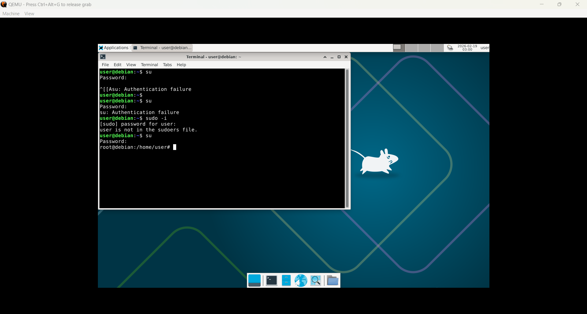
Далее я покажу мой путь отключению gui на вм, стоит отметить что шрафический интерфейс довольно миленький.

С помощью данных команд и коробки цветных карандашей, gui был несчадно снесен. 

```su
apt purge task-desktop task-xfce-desktop xfce4* -y
apt autoremove --purge -y
systemctl set-default multi-user.target
reboot
```
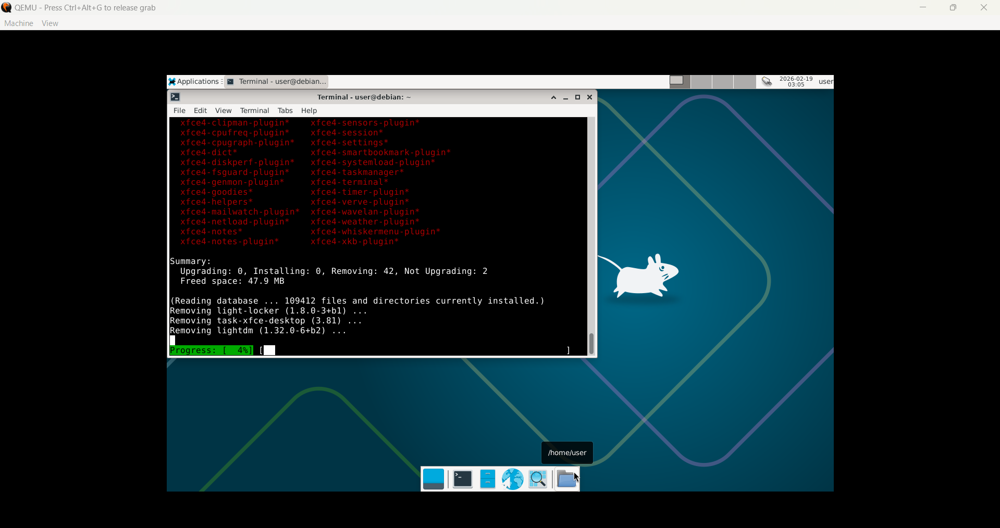


Тут мы уже перешли на правильный вид)


Далее, нам необходимо было установите LAMP в виртуальной машине. Для этого переключиться на суперпользователя и выполнить команды:
```
su
apt update -y
apt install -y apache2 php libapache2-mod-php php-mysql mariadb-server mariadb-client unzip
```

Но, если вы обратите внимание на предыдущий скриншот, то увилите, что что-то идет не так...

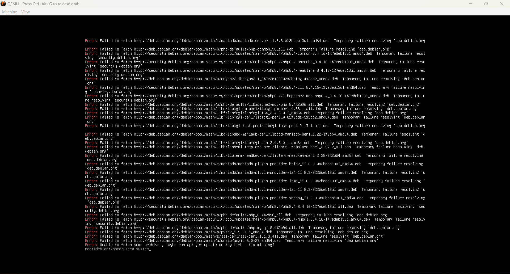

А на этом скриншоте все пошло совсем не так.
Оказалось,что внутри вм нет интернета, в начале, я попробовала перезагрузить вм, в надежде что не указала сетевые настройки в команде запуска, но нет. 
Далее были проделаны шаги, дабы таки сеть появилась.

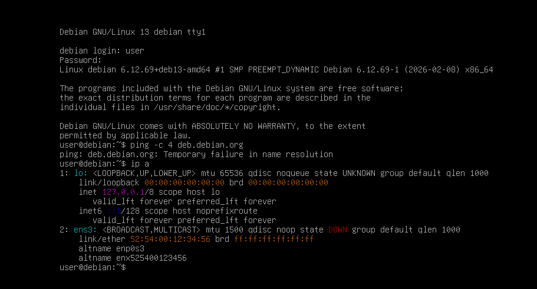

С помощью ***магии*** и некоторого количества команд, добиваемся того, что интернет внутри появляется.

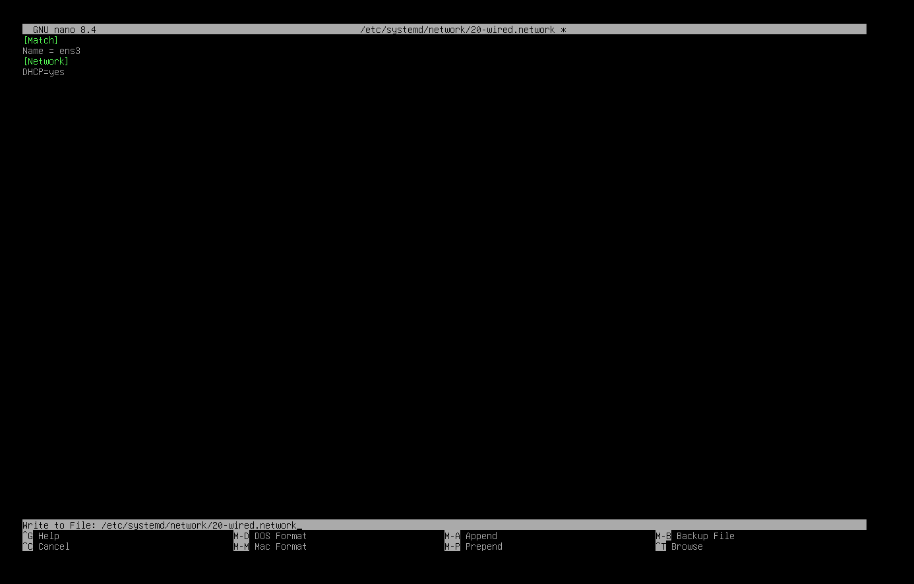

Наконец возвращаемся к выполнению требований лабораторной, а не исправлению криворукости автора данной лабораторной работы.

Выполняем таки данные команды и к своему великому счастью видим что началась установка:
```
su
apt update -y
apt install -y apache2 php libapache2-mod-php php-mysql mariadb-server mariadb-client unzip
```

где: 
- `apache2` - веб сервер 
- `php` - нужен WordPress, так как последний написан именноь на php 
- `libapache2-mod-php` - модуль, который связывает php и mysql/mariadb
- `mariadb-server` - сервеб бд для хранения данных сайта
- `mariadb-client` - клиент для работы с бд, позволяет подключиться выполнять команды 
- `unzip` - утилита для распаковки архивов


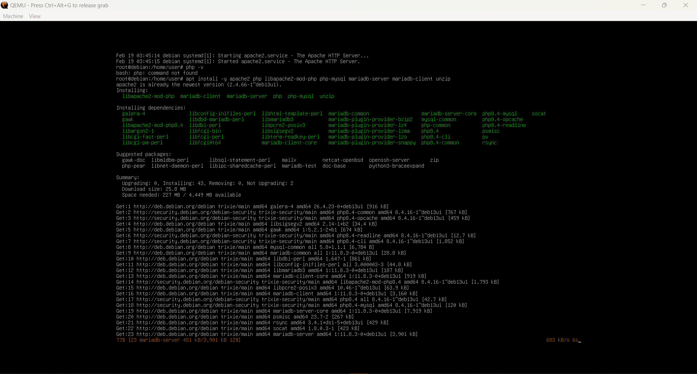

Далее скачиваем СУБД [PhpMyAdminhttps](://www.phpmyadmin.net/)
и [CMS WordPress](https://wordpress.org/download/)

На этом моменте я устала переписывать команды с moodle руками в терминал вм, поэтому с помощью магии, двух коробок цветных карандашей и всевидящего интелекта, была реализована система удалённого подключения к виртуальной машине через SSH.

Звучит очень заумно если честно...

Так вот, были проделаны следующие шаги, дабы было в последствии удобно работать 

- Установка и запуск SSH-сервера в Debian.Обязательно проверяем если все работает
```
apt update
apt install openssh-server
systemctl status ssh
```
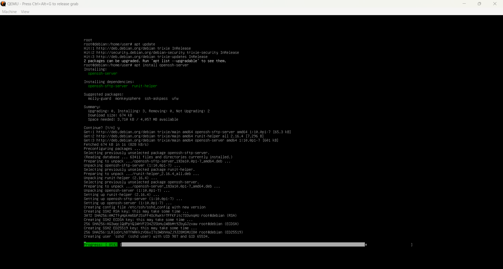
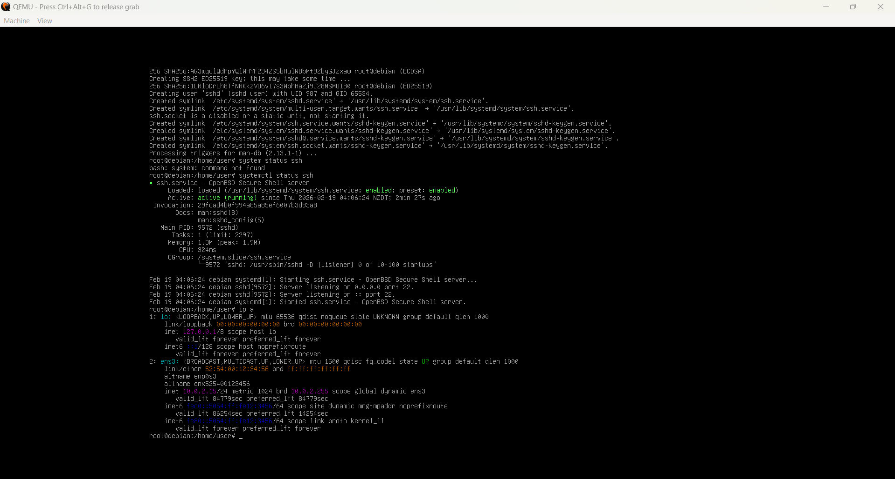

- Подключение через PowerShell. Подключаемся к SSh с помощью команды: 
`ssh user@localhost -p 1022`

где: 

- `user` - имя пользователя Debian
- `localhost` - локальный компьютер Windows
- `p 1022` - порт, перенаправленный в QEMU

На этот раз все получилось с первого раза и далее я работала с большим удобством, имея возможность вставлять и копировать команды. 


Скачиваем PhpMyAdmin и WordPress, проверяем если файлы скачались.

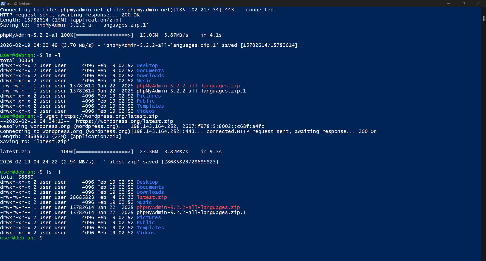

Далее создаем папку /var/www и распаковываем туда скачаные архивы 

```

mkdir /var/www
unzip phpMyAdmin-5.2.2-all-languages.zip
mv phpMyAdmin-5.2.2-all-languages /var/www/phpmyadmin
unzip latest.zip
mv wordpress /var/www/wordpress

```

Далее создаем через командную строку базу данных wordpress_db 

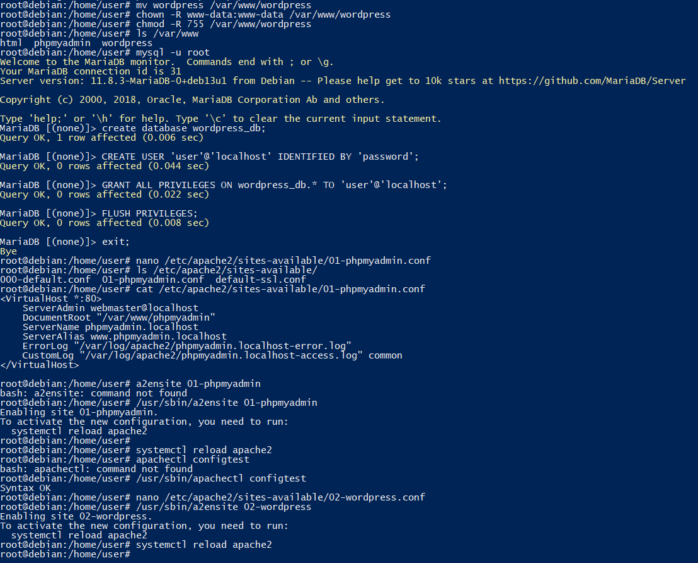

```
mysql -u root
CREATE DATABASE wordpress_db;
CREATE USER 'user'@'localhost' IDENTIFIED BY 'password';
GRANT ALL PRIVILEGES ON wordpress_db.* TO 'user'@'localhost';
FLUSH PRIVILEGES;
EXIT;
```
В папке /etc/apache2/sites-available создаем файл 01-phpmyadmin.conf

с содержимым:
```
<VirtualHost *:80>
    ServerAdmin webmaster@localhost
    DocumentRoot "/var/www/phpmyadmin"
    ServerName phpmyadmin.localhost
    ServerAlias www.phpmyadmin.localhost
    ErrorLog "/var/log/apache2/phpmyadmin.localhost-error.log"
    CustomLog "/var/log/apache2/phpmyadmin.localhost-access.log" common
</VirtualHost>
```

В папке /etc/apache2/sites-available создаем файл 02-wordpress.conf

nano /etc/apache2/sites-available/02-wordpress.conf
с содержимым:
```

<VirtualHost *:80>
    ServerAdmin webmaster@localhost
    DocumentRoot "/var/www/wordpress"
    ServerName wordpress.localhost
    ServerAlias www.wordpress.localhost
    ErrorLog "/var/log/apache2/wordpress.localhost-error.log"
    CustomLog "/var/log/apache2/wordpress.localhost-access.log" common
</VirtualHost>
```
Регестрирую конфигурации, выполнив команды:

- `/usr/sbin/a2ensite 01-phpmyadmin`
- `/usr/sbin/a2ensite 02-wordpress`

Добавляю в файл /etc/hosts строки:

- `127.0.0.1 phpmyadmin.localhost`
- `127.0.0.1 wordpress.localhost`

В открывшемся консольном окне выполните команду uname -a.

Видим результат: инвормация о запущенной системе 
- имя ядра (Linux)
- имя хоста
- версию ядра
- дату сборки ядра
- архитектуру (например x86_64)

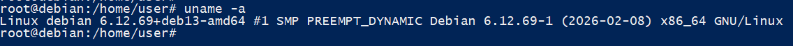

Что бы перезагрузить Apace web server используем команду : `systemctl restart apache2` 

В браузере проверяем доступность сайтов: 

- http://wordpress.localhost:1080
- http://phpmyadmin.localhost:1080

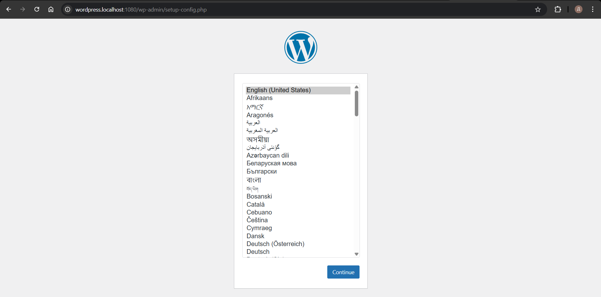
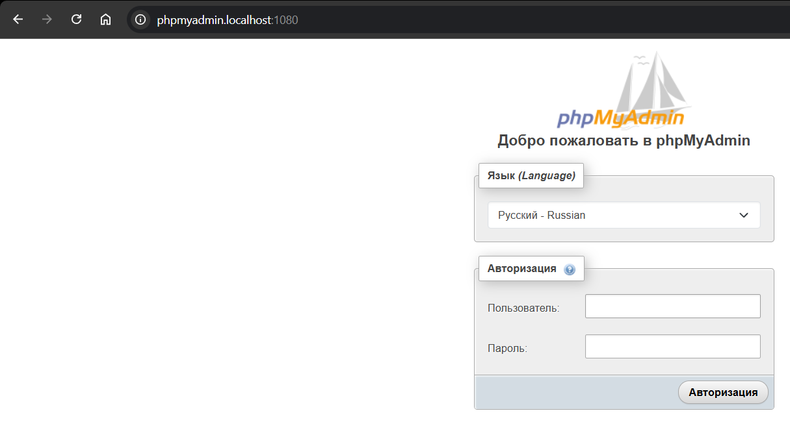

Доп вопросы: 

1. Каким образом можно скачать файл в консоли при помощи утилиты wget?

    Скачивание выполняется командой: wget URL_файла. выполняет HTTP/HTTPS-запрос,скачивает файл по указанному адресу,сохраняет его в текущей директории.

2. Зачем необходимо создавать для каждого сайта свою базу и своего пользователя?
   
    Необходимо это для обеспечения изоляции данных, удобства администрирования и безопасности. 
3. Как поменять доступ к системе управления БД на порт 1234?
    
    Необходимо изменить порт в Apace /etc/apache2/ports.conf приказать слушать не 80, а 1234. Изменить вритуальный хост
    /etc/apache2/sites-available/000-default.conf и указать <VirtualHost *:1234>

4. Какие преимущества, с вашей точки зрения, даёт виртуализация?

    Изоляция систем, возможность развертывания нескольких операционных систем на одном сервере, можно перенести виртуальную машину файлом, вместе со всем что на ней лежит. 

5. Для чего необходимо устанавливать время / временную зону на сервере?

    Для введения логов, для ssl сертификатов, из за неверного времени соединение может прерываться, синхронизация баз данных. Аутентификация с помощью токенов.
6. Сколько места занимает установленная вами ОС (виртуальный диск) на хостовой машине?

    
    6001917952 байт ≈ 5.6 ГБ

7. Какие есть рекомендации по разбиению диска для серверов? Почему рекомендуется так разбивать диск?

Рекомендуется разделять диск на несколько разделов:

- / (корневая система) 
- /home - отделяется для защиты пользовательских данных
- /var - содержит логи и базы данных — если они переполнятся, не будет нарушена работа всей системы
- /tmp - может заполняться временными файлами

## Библиография : 
-[Много умных слов](http://www.regatta.cs.msu.su/doc/usr/share/man/info/ru_RU/a_doc_lib/aixuser/usrosdev/user_sys_id.htm#:~:text=5.1%20Commands%20Reference.-,%D0%9F%D1%80%D0%BE%D1%81%D0%BC%D0%BE%D1%82%D1%80%20%D0%B8%D0%BC%D0%B5%D0%BD%D0%B8%20%D1%81%D0%B8%D1%81%D1%82%D0%B5%D0%BC%D1%8B%20(%D0%BA%D0%BE%D0%BC%D0%B0%D0%BD%D0%B4%D0%B0%20uname),%D0%B6%D0%B5%20%D1%81%D0%B0%D0%BC%D0%BE%D0%B5%2C%20%D1%87%D1%82%D0%BE%20%D0%98%D0%94%20%D0%BF%D0%BE%D0%BB%D1%8C%D0%B7%D0%BE%D0%B2%D0%B0%D1%82%D0%B5%D0%BB%D1%8F.)
- [Ваш курс)](https://elearning.usm.md/mod/assign/view.php?id=281960)

